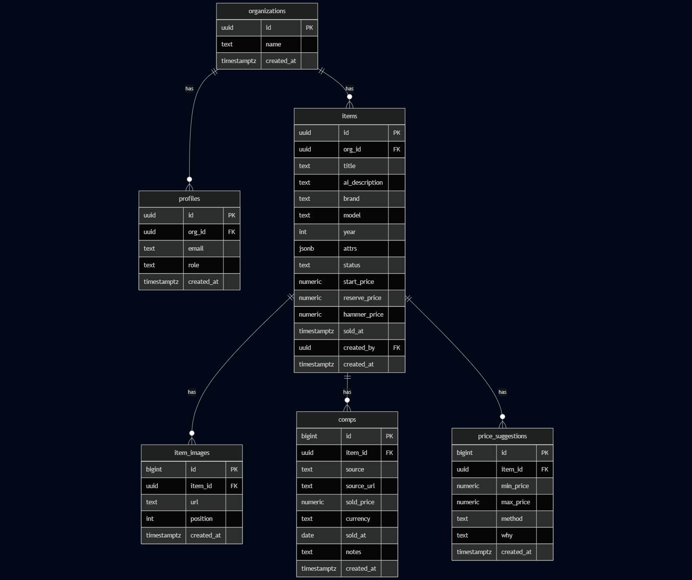

# AuctionSwift DataBase
## Database Design
### Overview
This repository provides a minimal, end-to-end setup to validate connectivity between a local Python environment and a Supabase (PostgreSQL) database with **Row Level Security (RLS)**. It includes a concise schema, seed data, a view for convenient reads, and scripts to (1) load environment variables, (2) connect with the anon key, (3) read data permitted by RLS, and (4) attempt a write that should be **blocked** under RLS. Use this as a quick sanity check before integrating the database into a larger app.


### Entity Relationship Diagram




### Tables (schema: `public`)

- **organizations** — tenant container  
  **Columns:** `id` (uuid, PK), `name` (text), `created_at` (timestamptz)

- **profiles** — user profile & org membership (maps to `auth.users.id`)  
  **Columns:** `id` (uuid, PK), `org_id` (uuid, FK → organizations.id), `email` (text, unique), `role` (text), `created_at` (timestamptz)

- **items** — example entity scoped to an organization  
  **Columns:** `id` (uuid, PK), `org_id` (uuid, FK → organizations.id), `title` (text), `ai_description` (text), `brand` (text), `model` (text), `year` (int), `attrs` (jsonb), `status` (text), `start_price` (numeric), `reserve_price` (numeric), `hammer_price` (numeric), `sold_at` (timestamptz), `created_by` (uuid, FK → profiles.id), `created_at` (timestamptz)

- **item_images** — images attached to items  
  **Columns:** `id` (bigserial, PK), `item_id` (uuid, FK → items.id), `url` (text), `position` (int), `created_at` (timestamptz)

- **comps** — comparable sales evidence per item  
  **Columns:** `id` (bigserial, PK), `item_id` (uuid, FK → items.id), `source` (text), `source_url` (text), `sold_price` (numeric), `currency` (text), `sold_at` (date), `notes` (text), `created_at` (timestamptz)

- **price_suggestions** — stored pricing guidance per item  
  **Columns:** `id` (bigserial, PK), `item_id` (uuid, FK → items.id), `min_price` (numeric), `max_price` (numeric), `method` (text), `why` (text), `created_at` (timestamptz)

### Views

- **item_summary** — aggregates related info per item (e.g., latest price suggestion and comp list) to simplify read queries.

---

### Security Model (RLS)

RLS is **enabled** on: `organizations`, `profiles`, `items`, `item_images`, `comps`, `price_suggestions`.

- **profiles:** users can read/insert only the row that matches their `auth.uid()`.  
- **organizations:** users can read organizations they belong to (via `profiles`).  
- **items / item_images / comps / price_suggestions:** users can read/write only rows that belong to their organization (enforced via `org_id` or the parent item’s org).

All policy definitions live in `sql/rls_policies.sql`.

---

## Seed Data

- One organization (e.g., “Acme Auctions”).  
- One `profiles` row linking **your** auth user (replace placeholder in the seed script) to that organization.  
- Sample `items`, `comps`, and a `price_suggestions` entry to verify reads/joins.

---

## How It Works

1. **Auth & identity:** Your authenticated user’s UUID (`auth.uid()`) must exist in `profiles` and be linked to an `org_id`.  
2. **Org-scoped reads:** Selecting from `items` (and related tables) returns only rows for your organization.  
3. **Writes under RLS:** Inserts/updates/deletes are allowed only if the target row belongs to your organization; anonymous clients are denied.  
4. **Summary reads:** The `item_summary` view provides a read-optimized record that combines item details with the latest suggestion and comps.


## Requirements
- Python 3.10+
- Supabase project URL + **anon** API key


## Repository Structure

```
├── test_connection.py # connect, read test, write attempt (RLS should block)
├── check_env.py # verifies .env is loaded correctly
├── sql/
│ ├── schema.sql # tables, constraints, RLS policies
│ └── seed.sql # sample data
├── docs/
│ └── er-diagram.png # ER diagram matching schema.sql
├── .gitignore # excludes .env, venv/, etc.
└── README.md # this file

```
> Copy `.env.example` to `.env` and fill in your Supabase credentials before running scripts.


## Setup

### 1) Clone the repository
```bash

git clone https://github.com/georgiatttt/AuctionSwift.git
cd AuctionSwift

```
**Create and activate a virtual environment**
```
python3 -m venv venv
# macOS/Linux
source venv/bin/activate
# Windows (PowerShell)
# .\venv\Scripts\Activate.ps1
```
**Install Dependencies**
```
pip install supabase python-dotenv
```
**Configure environment variables (local only; do NOT commit)**

Create a .env file in the project root:
```
SUPABASE_URL=your_project_url
SUPABASE_ANON_KEY=your_anon_key
```
**Apply schema and seed data in Supabase**

- Open ***Supabase*** -> ***SQL Editor***
- Run sql/schema.sql
- Run sql/seed.sql

**How to Run**
***Environment Check***
```
python check_env.py
```
***Connection & RLS verification***
```
python test_connection.py
```
## Join Query Test
Validate relational integrity and RLS-permitted visibility:
```
SELECT 
  items.title,
  items.brand,
  organizations.name AS organization_name
FROM items
JOIN organizations
  ON items.org_id = organizations.id;
```

## Team Contributions (see commits for details)
Ahmmed: homepage
Georgia: login 
John: agent 
